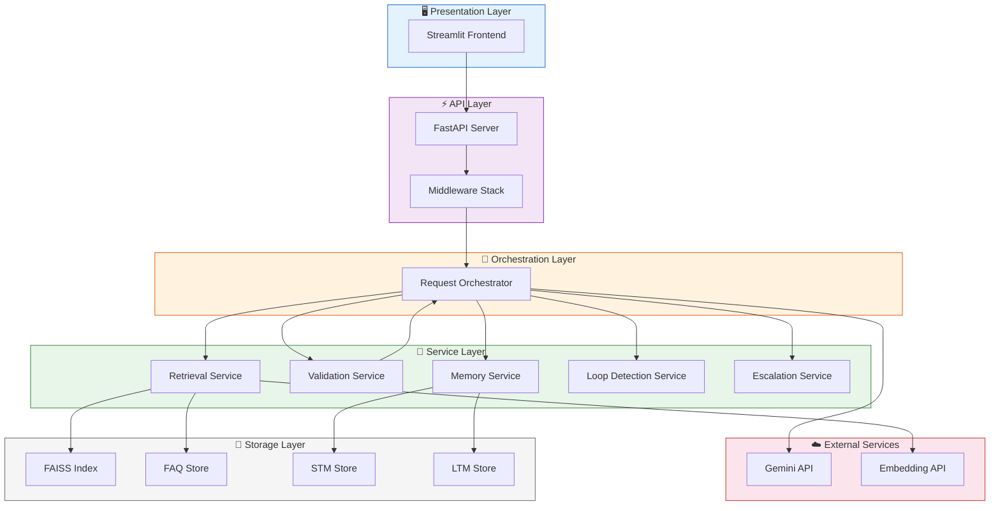
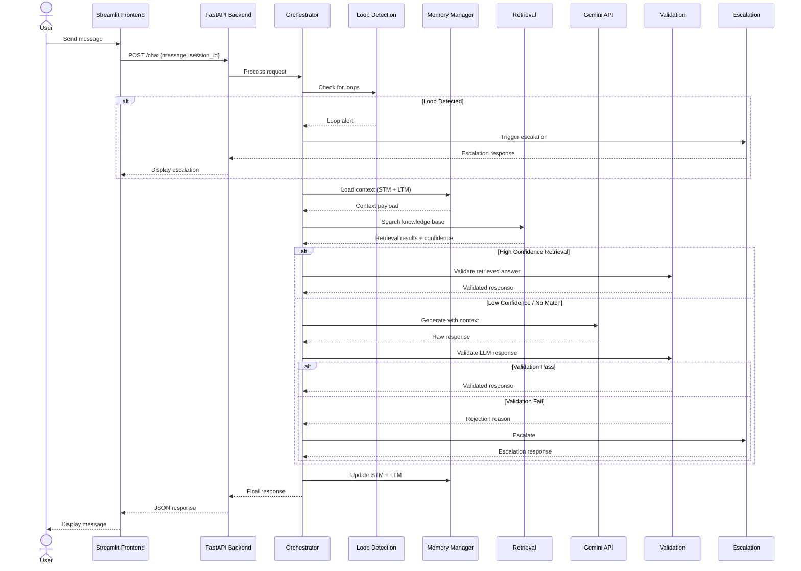

<
- [Component Architecture](#component-architecture)
- [Data Flow](#data-flow)
- [Request Lifecycle](#request-lifecycle)
- [Error Handling Strategy](#error-handling-strategy)
- [Scalability Considerations](#scalability-considerations)
- [Security Notes](#security-notes)

---

## System Overview

NovaDesk AI Support System follows a **layered architecture** with clear separation of concerns. Each layer has a single responsibility and communicates through well-defined interfaces.



---

## Component Architecture

### 1. Presentation Layer — Streamlit Frontend

| Aspect | Detail |
|--------|--------|
| **Responsibility** | User interaction, chat rendering, session management |
| **Technology** | Streamlit 1.28+ |
| **Communication** | HTTP REST calls to FastAPI backend |
| **State** | Client-side session state via `st.session_state` |

**Key behaviors:**
- Renders chat messages with role-based styling (user / assistant / system)
- Displays escalation alerts with visual prominence
- Manages conversation history in session state
- Provides sidebar controls for session info and history management

### 2. API Layer — FastAPI Backend

| Aspect | Detail |
|--------|--------|
| **Responsibility** | Request handling, routing, input validation, middleware |
| **Technology** | FastAPI 0.104+ with Uvicorn |
| **Endpoints** | `/chat`, `/health`, `/session/*`, `/escalate` |
| **Middleware** | CORS, request logging, rate limiting, error handling |

**Middleware stack (execution order):**
1. CORS handling
2. Request ID injection
3. Structured logging
4. Rate limiting
5. Error boundary

### 3. Orchestration Layer

| Aspect | Detail |
|--------|--------|
| **Responsibility** | Coordinates service calls, manages request flow, decision logic |
| **Pattern** | Orchestrator / Pipeline pattern |
| **Key Decisions** | Retrieval strategy selection, validation routing, escalation triggers |

**Orchestration flow:**
```
Receive Request
  → Check loop detection
  → Load memory context (STM + LTM)
  → Execute retrieval pipeline
  → If retrieval confident → Validate → Return
  → If retrieval uncertain → Call Gemini with context → Validate → Return
  → If validation fails → Retry or Escalate
```

### 4. Service Layer

#### 4a. Retrieval Service
- Deterministic FAQ matching (keyword + fuzzy)
- Semantic FAISS search with embedding vectors
- Result ranking and confidence scoring
- Context assembly for LLM prompts

#### 4b. Validation Service
- Confidence threshold evaluation
- Hallucination detection (grounding against knowledge base)
- Policy compliance checking (prohibited content, tone)
- Format validation (length, structure, completeness)

#### 4c. Memory Service
- STM: In-memory conversation buffer per session
- LTM: Persistent user history across sessions
- Context window management and summarization

#### 4d. Loop Detection Service
- Sliding window analysis over recent queries
- Semantic similarity comparison between consecutive messages
- Configurable thresholds (`LOOP_DETECTION_WINDOW`, `MAX_LOOP_COUNT`)

#### 4e. Escalation Service
- Trigger evaluation from multiple signals
- Graceful handoff messaging
- Conversation summary generation for human agents
- Escalation logging and metrics

### 5. Storage Layer

| Store | Type | Purpose | Persistence |
|-------|------|---------|-------------|
| FAISS Index | Vector store | Semantic search indices | File-based |
| FAQ Store | JSON/CSV | Deterministic FAQ data | File-based |
| STM Store | In-memory dict | Session conversation buffer | Ephemeral |
| LTM Store | JSON/SQLite | User history and profiles | Persistent |

---

## Data Flow

### Complete Request Data Flow



---

## Request Lifecycle

A single user message goes through the following stages:

### Stage 1: Ingestion
1. User submits message via Streamlit chat input
2. Frontend packages `{message, session_id, user_id}` into HTTP request
3. FastAPI receives request, assigns `request_id`, logs entry

### Stage 2: Pre-Processing
4. Loop detection analyzes message against recent history
5. Memory service loads STM (current session) and LTM (user history)
6. Context payload is assembled for downstream services

### Stage 3: Retrieval
7. Deterministic FAQ matcher checks for exact/fuzzy keyword hits
8. If no FAQ match: FAISS semantic search against embedded knowledge base
9. Results ranked by confidence score

### Stage 4: Response Generation
10. **High confidence retrieval (>0.85):** Use retrieved answer directly
11. **Medium confidence (0.60–0.85):** Augment retrieval with LLM refinement
12. **Low confidence (<0.60):** Full LLM generation with retrieval context

### Stage 5: Validation
13. Confidence scoring on the generated response
14. Hallucination detection (grounding check against source material)
15. Policy compliance scan
16. Format validation

### Stage 6: Delivery or Escalation
17. **Validation pass:** Response delivered to user via API
18. **Validation fail:** Retry once with stricter constraints, then escalate
19. Memory stores updated (STM append, LTM summary update)
20. Request logged with full trace for observability

---

## Error Handling Strategy

NovaDesk employs a **multi-layer error handling** approach:

### Layer 1: Input Validation (FastAPI)
- Pydantic models enforce request schema
- Invalid inputs return `422 Unprocessable Entity` with clear error messages
- Rate limiting prevents abuse

### Layer 2: Service Errors (Orchestrator)
- Each service call is wrapped in try/catch with typed exceptions
- Transient errors (API timeouts) trigger retries with exponential backoff
- Permanent errors (invalid API key) surface immediately with actionable messages

### Layer 3: External API Errors (Gemini)
- API rate limits → Queue with backoff
- API downtime → Fallback to retrieval-only mode
- Malformed responses → Retry with simplified prompt
- Token limit exceeded → Context truncation and retry

### Layer 4: Graceful Degradation
```
Full Pipeline → Retrieval-Only Mode → Cached Response → Escalation Message
```

| Failure Scenario | Degradation Response |
|-----------------|---------------------|
| Gemini API down | Serve retrieval-only answers |
| FAISS index corrupt | Fall back to FAQ-only matching |
| All retrieval fails | Provide apologetic escalation message |
| Memory service error | Continue without context (stateless mode) |

### Error Response Format
```json
{
  "status": "error",
  "error_code": "RETRIEVAL_FAILED",
  "message": "Unable to find a confident answer. Escalating to support team.",
  "request_id": "req_abc123",
  "escalated": true
}
```

---

## Scalability Considerations

### Current Design (Demo/Development)
- Single-process FastAPI with Uvicorn
- In-memory STM (no external store)
- File-based FAISS index
- Single Streamlit instance

### Production Scaling Path

| Component | Current | Scaled |
|-----------|---------|--------|
| **API Server** | Single Uvicorn process | Multiple workers behind load balancer |
| **STM Store** | In-memory dict | Redis cluster |
| **LTM Store** | Local JSON/SQLite | PostgreSQL with read replicas |
| **FAISS Index** | Single file, CPU | Distributed FAISS or Pinecone/Weaviate |
| **Gemini Calls** | Synchronous | Async with connection pooling |
| **Frontend** | Single Streamlit | Containerized replicas |
| **Monitoring** | Rich console logs | Prometheus + Grafana + structured JSON logs |

### Horizontal Scaling Considerations
- **Stateless API:** STM externalized to Redis enables any API instance to handle any session
- **FAISS Sharding:** Large knowledge bases can be partitioned across multiple FAISS indices
- **Async Processing:** Long-running validation can be offloaded to task queues (Celery/RQ)
- **Caching:** Frequently asked questions cached at the API layer to reduce retrieval load

---

## Security Notes

### API Security
- **API Key Protection:** Gemini API key stored in environment variables, never in code
- **Input Sanitization:** All user inputs validated and sanitized before processing
- **Rate Limiting:** Per-IP and per-session rate limits to prevent abuse
- **CORS:** Restricted to known frontend origins in production

### Data Security
- **No PII Storage:** STM/LTM should not store personally identifiable information
- **Conversation Encryption:** LTM data should be encrypted at rest in production
- **Audit Logging:** All escalation events logged with full context for compliance

### LLM Security
- **Prompt Injection Defense:** User inputs wrapped in structured templates, not raw-concatenated
- **Output Filtering:** Validation pipeline catches policy-violating LLM outputs
- **Context Isolation:** Each session's context is isolated; no cross-session data leakage

### Deployment Security
- **Environment Isolation:** Development, staging, and production environments fully separated
- **Dependency Pinning:** All dependencies version-pinned in `requirements.txt`
- **Secret Management:** Production should use a secret manager (e.g., Google Secret Manager, HashiCorp Vault)

---

> **Note:** This document is maintained alongside the codebase. Update it when architectural decisions change.
]]>
