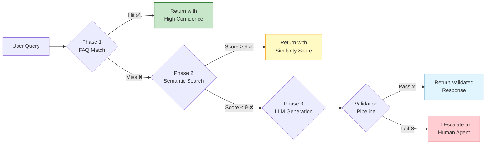
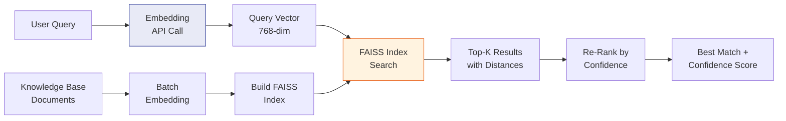
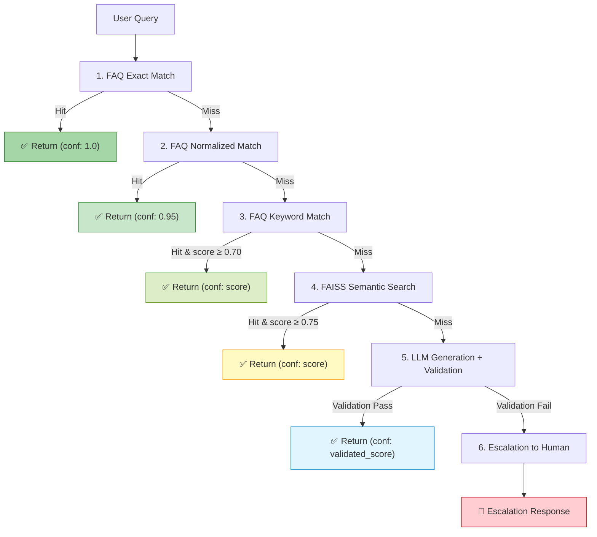
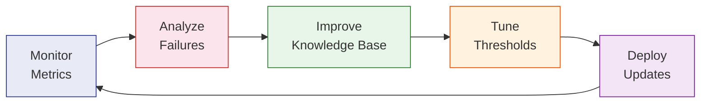

<
- [Two-Phase Retrieval Pipeline](#two-phase-retrieval-pipeline)
- [Phase 1: Deterministic FAQ Matching](#phase-1-deterministic-faq-matching)
- [Phase 2: Semantic FAISS Search](#phase-2-semantic-faiss-search)
- [Embedding Model Selection](#embedding-model-selection)
- [Confidence Scoring Methodology](#confidence-scoring-methodology)
- [Fallback Chain](#fallback-chain)
- [Context Window Management](#context-window-management)
- [Retrieval Quality Metrics](#retrieval-quality-metrics)

---

## Overview

NovaDesk's retrieval system is designed around a core principle: **prefer deterministic, verifiable answers over generated ones whenever possible.** The system uses a cascading retrieval strategy that escalates from fast, high-confidence lookups to slower, lower-confidence generation only when necessary.



---

## Two-Phase Retrieval Pipeline

The pipeline processes queries through two sequential phases before falling back to LLM generation:

| Phase | Method | Latency | Confidence | Hallucination Risk |
|-------|--------|---------|------------|-------------------|
| **Phase 1** | Deterministic FAQ Match | ~1–5 ms | Very High (0.95+) | Zero |
| **Phase 2** | Semantic FAISS Search | ~10–50 ms | Variable (0.50–0.95) | Very Low |
| **Phase 3** | LLM Generation (Fallback) | ~500–3000 ms | Variable (0.30–0.90) | Moderate |

### Why Two Phases?

1. **Speed:** Deterministic matching is orders of magnitude faster than vector search
2. **Reliability:** FAQ matches are verified human-authored answers with zero hallucination risk
3. **Cost:** Avoiding unnecessary embedding API calls and LLM invocations reduces operational costs
4. **Predictability:** Deterministic responses enable easier testing and quality assurance

---

## Phase 1: Deterministic FAQ Matching

### Matching Strategy

Phase 1 uses a **multi-signal keyword matching** approach:

```
Query: "How do I reset my password?"

Signal 1 — Exact Match:
  FAQ entry key: "how do i reset my password" → EXACT HIT (score: 1.0)

Signal 2 — Normalized Match:
  Lowercase + strip punctuation + stem → "how reset password"
  FAQ normalized key: "how reset password" → NORMALIZED HIT (score: 0.95)

Signal 3 — Keyword Overlap:
  Query keywords: {"reset", "password"}
  FAQ keywords: {"reset", "password", "account"}
  Jaccard similarity: 2/3 = 0.67 → PARTIAL MATCH (score: 0.67)
```

### Matching Rules

| Signal | Technique | Min Score | Priority |
|--------|-----------|-----------|----------|
| Exact match | Case-insensitive string comparison | 1.00 | Highest |
| Normalized match | Lowercased, stemmed, punctuation-stripped | 0.95 | High |
| Keyword overlap | Jaccard similarity on keyword sets | 0.70 | Medium |
| Fuzzy match | Levenshtein distance ratio | 0.80 | Low |

### FAQ Data Format

```json
{
  "faqs": [
    {
      "id": "faq_001",
      "question": "How do I reset my password?",
      "keywords": ["reset", "password", "forgot", "change"],
      "answer": "To reset your password, go to Settings > Security > Reset Password...",
      "category": "account",
      "last_updated": "2026-01-15"
    }
  ]
}
```

### Phase 1 Decision Logic

```python
def phase1_match(query: str, faq_store: FAQStore) -> Optional[RetrievalResult]:
    # Signal 1: Exact match
    exact = faq_store.exact_lookup(query.lower().strip())
    if exact:
        return RetrievalResult(answer=exact.answer, confidence=1.0, source="faq_exact")
    
    # Signal 2: Normalized match
    normalized = normalize(query)  # lowercase, stem, strip
    norm_match = faq_store.normalized_lookup(normalized)
    if norm_match:
        return RetrievalResult(answer=norm_match.answer, confidence=0.95, source="faq_normalized")
    
    # Signal 3: Keyword overlap
    keywords = extract_keywords(query)
    keyword_match = faq_store.keyword_search(keywords, min_jaccard=0.70)
    if keyword_match:
        return RetrievalResult(
            answer=keyword_match.answer,
            confidence=keyword_match.jaccard_score,
            source="faq_keyword"
        )
    
    return None  # Proceed to Phase 2
```

---

## Phase 2: Semantic FAISS Search

### Architecture

Phase 2 converts the user query into an embedding vector and searches a pre-built FAISS index for semantically similar knowledge base entries.



### FAISS Configuration

| Parameter | Value | Rationale |
|-----------|-------|-----------|
| **Index Type** | `IndexFlatIP` (Inner Product) | Exact search for small-to-medium knowledge bases (<100K docs) |
| **Vector Dimension** | 768 | Google embedding model output dimension |
| **Distance Metric** | Cosine similarity (via normalized vectors) | Standard for text similarity |
| **Top-K** | 3 | Return top 3 candidates for re-ranking |
| **Similarity Threshold** | 0.75 (configurable) | Minimum cosine similarity to consider a match |

### Index Building Process

```python
def build_index(knowledge_base: List[Document]) -> faiss.Index:
    # 1. Generate embeddings for all documents
    embeddings = embedding_model.embed_batch([doc.content for doc in knowledge_base])
    
    # 2. Normalize vectors for cosine similarity
    faiss.normalize_L2(embeddings)
    
    # 3. Build FAISS index
    dimension = embeddings.shape[1]  # 768
    index = faiss.IndexFlatIP(dimension)
    index.add(embeddings)
    
    # 4. Persist to disk
    faiss.write_index(index, FAISS_INDEX_PATH)
    
    return index
```

### Search Process

```python
def phase2_search(query: str, index: faiss.Index, k: int = 3) -> List[RetrievalResult]:
    # 1. Embed the query
    query_vector = embedding_model.embed(query)
    faiss.normalize_L2(query_vector.reshape(1, -1))
    
    # 2. Search FAISS index
    distances, indices = index.search(query_vector.reshape(1, -1), k)
    
    # 3. Filter by threshold and build results
    results = []
    for dist, idx in zip(distances[0], indices[0]):
        if dist >= CONFIDENCE_THRESHOLD:
            results.append(RetrievalResult(
                answer=knowledge_base[idx].content,
                confidence=float(dist),
                source="faiss_semantic"
            ))
    
    return sorted(results, key=lambda r: r.confidence, reverse=True)
```

---

## Embedding Model Selection

### Selected Model: `models/embedding-001` (Google)

| Criterion | Detail |
|-----------|--------|
| **Provider** | Google AI (Gemini ecosystem) |
| **Dimension** | 768 |
| **Max Input** | 2,048 tokens |
| **Strengths** | Strong on conversational queries, good multilingual support |
| **Integration** | Native with `google-generativeai` SDK |

### Why This Model?

1. **Ecosystem Consistency:** Same provider as the generation model (Gemini), reducing integration complexity
2. **Quality:** Strong performance on semantic textual similarity benchmarks
3. **Cost:** Included in the Gemini API pricing tier, no additional vendor
4. **Latency:** Fast inference times suitable for real-time support applications
5. **Dimension:** 768-dim vectors provide a good balance of quality vs. storage/compute

### Alternatives Considered

| Model | Dimension | Pros | Cons | Decision |
|-------|-----------|------|------|----------|
| `models/embedding-001` | 768 | Native integration, good quality | Google-only ecosystem | ✅ Selected |
| `text-embedding-3-small` (OpenAI) | 1536 | High quality, widely used | Different vendor, higher cost | ❌ Rejected |
| `all-MiniLM-L6-v2` (SBERT) | 384 | Free, local inference | Lower quality on complex queries | ❌ Rejected |
| `e5-large-v2` | 1024 | State-of-the-art accuracy | High memory, slow inference | ❌ Rejected |

---

## Confidence Scoring Methodology

### Composite Confidence Score

The final confidence score is a **weighted composite** of multiple signals:

```
confidence = w1 * retrieval_score + w2 * relevance_score + w3 * recency_score
```

| Signal | Weight | Range | Description |
|--------|--------|-------|-------------|
| **Retrieval Score** | 0.60 | 0.0–1.0 | Raw similarity/match score from retrieval phase |
| **Relevance Score** | 0.30 | 0.0–1.0 | Query-answer semantic alignment check |
| **Recency Score** | 0.10 | 0.0–1.0 | How recently the knowledge base entry was updated |

### Confidence Tiers

| Tier | Score Range | Action | Rationale |
|------|-------------|--------|-----------|
| 🟢 **High** | > 0.85 | Serve directly | Strong match, high reliability |
| 🟡 **Medium** | 0.60 – 0.85 | Serve with disclaimer | Reasonable match, may need refinement |
| 🔴 **Low** | < 0.60 | Escalate or augment with LLM | Insufficient confidence for direct delivery |

### Score Calibration

Confidence scores are calibrated through:

1. **Historical Analysis:** Compare predicted confidence against user satisfaction signals
2. **Threshold Tuning:** Adjust tier boundaries based on escalation rates and resolution accuracy
3. **A/B Testing:** Test threshold variations to optimize the trade-off between automation rate and accuracy

---

## Fallback Chain

The complete fallback chain from highest to lowest confidence:



### Fallback Chain Rules

1. **Short-circuit on high confidence:** Stop at the first phase that returns confidence ≥ 0.85
2. **Aggregate on medium confidence:** If Phase 1 returns medium confidence, still check Phase 2 for a better match
3. **Never skip validation:** Even high-confidence retrieval results pass through basic format validation
4. **Escalation is terminal:** Once escalated, do not retry with lower-quality methods

---

## Context Window Management

### Challenge

LLM context windows have finite capacity. We must strategically select what context to include in the generation prompt.

### Context Assembly Priority

```
[System Prompt]                          ~200 tokens (fixed)
[Retrieved Knowledge Base Entries]       ~500 tokens (variable, up to 3 entries)
[STM: Recent Conversation Messages]      ~800 tokens (variable, last 5-10 messages)
[LTM: User Summary]                     ~200 tokens (compressed summary)
[User Query]                             ~100 tokens (variable)
─────────────────────────────────────
Total Budget                             ~1,800 tokens input
```

### Context Truncation Strategy

When context exceeds the budget:

1. **LTM Summary:** Compress to key facts only (past issues, preferences)
2. **STM Messages:** Keep most recent 5 messages, summarize older ones
3. **Retrieved Entries:** Keep top-1 entry (highest confidence), summarize others
4. **System Prompt:** Never truncated (critical for behavior)
5. **User Query:** Never truncated (the primary input)

### Context Assembly Code

```python
def assemble_context(
    query: str,
    retrieval_results: List[RetrievalResult],
    stm: ShortTermMemory,
    ltm: LongTermMemory,
    max_tokens: int = 1800
) -> str:
    sections = []
    budget = max_tokens
    
    # 1. System prompt (never truncated)
    system = get_system_prompt()
    sections.append(system)
    budget -= count_tokens(system)
    
    # 2. User query (never truncated)
    sections.append(f"User Query: {query}")
    budget -= count_tokens(query) + 20
    
    # 3. Retrieved knowledge (up to budget)
    for result in retrieval_results[:3]:
        entry = f"Knowledge Base [{result.source}] (conf: {result.confidence:.2f}):\n{result.answer}"
        tokens = count_tokens(entry)
        if tokens <= budget:
            sections.append(entry)
            budget -= tokens
    
    # 4. STM context
    stm_context = stm.get_recent(max_tokens=min(budget, 800))
    sections.append(f"Conversation History:\n{stm_context}")
    budget -= count_tokens(stm_context)
    
    # 5. LTM summary (if budget allows)
    if budget > 100:
        ltm_summary = ltm.get_summary(max_tokens=min(budget, 200))
        sections.append(f"User Profile:\n{ltm_summary}")
    
    return "\n\n---\n\n".join(sections)
```

---

## Retrieval Quality Metrics

### Key Metrics to Track

| Metric | Formula | Target | Description |
|--------|---------|--------|-------------|
| **Retrieval Hit Rate** | Hits / Total Queries | > 70% | Percentage of queries answered by retrieval (Phase 1 + 2) |
| **FAQ Hit Rate** | FAQ Hits / Total Queries | > 40% | Percentage resolved by deterministic FAQ matching |
| **Mean Confidence** | Avg(confidence scores) | > 0.80 | Average confidence across all served responses |
| **Escalation Rate** | Escalations / Total Queries | < 15% | Percentage of queries requiring human escalation |
| **Latency P50** | Median response time | < 500 ms | Median end-to-end response latency |
| **Latency P99** | 99th percentile response time | < 3,000 ms | Tail latency (includes LLM generation) |
| **False Positive Rate** | Incorrect high-confidence / Total | < 5% | High-confidence responses that were wrong |

### Quality Improvement Cycle



1. **Monitor:** Track all metrics in real-time dashboards
2. **Analyze:** Review escalated queries and low-confidence responses
3. **Improve:** Add missing FAQs, update outdated entries, expand keyword lists
4. **Tune:** Adjust confidence thresholds and matching parameters
5. **Deploy:** Push updated knowledge base and configuration

---

> **Note:** This document describes the target retrieval architecture. Implementation is incremental — start with Phase 1 (FAQ matching), then add Phase 2 (FAISS), then Phase 3 (LLM fallback).
]]>
