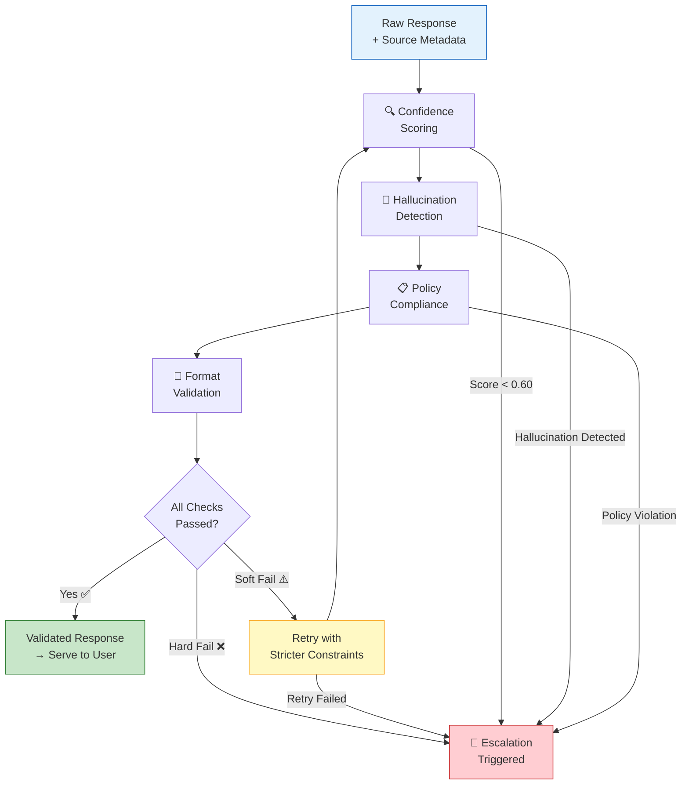
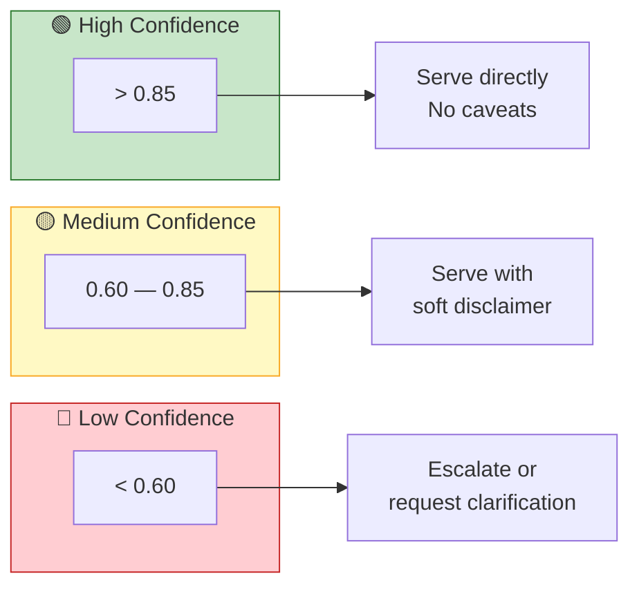
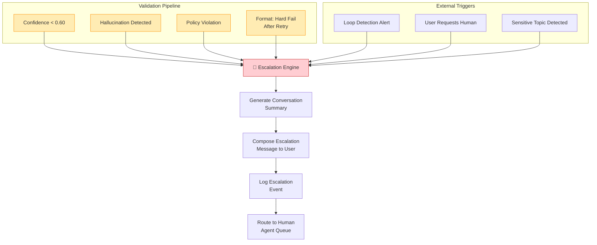

<
- [Pipeline Architecture](#pipeline-architecture)
- [Pre-Response Validation Checks](#pre-response-validation-checks)
- [Confidence Threshold Tiers](#confidence-threshold-tiers)
- [Hallucination Detection](#hallucination-detection)
- [Policy Compliance Verification](#policy-compliance-verification)
- [Response Formatting Standards](#response-formatting-standards)
- [Escalation Triggers from Validation Failures](#escalation-triggers-from-validation-failures)

---

## Overview

The validation pipeline is the **last line of defense** between the AI and the user. Every response — whether retrieved from the knowledge base or generated by the LLM — must pass through this pipeline before being served.

> **Core Principle:** No unvalidated AI response should ever reach the user. Even high-confidence retrieval results undergo basic validation.

### Design Goals

| Goal | Description |
|------|-------------|
| **Safety** | Prevent harmful, misleading, or policy-violating responses |
| **Accuracy** | Detect hallucinated or unsupported claims |
| **Quality** | Ensure responses are well-formatted and complete |
| **Transparency** | Clearly communicate confidence levels to the system |
| **Speed** | Validation should add minimal latency (<100ms for non-LLM checks) |

---

## Pipeline Architecture



### Pipeline Execution Order

The checks are executed **sequentially** in a fixed order. This is intentional:

1. **Confidence Scoring** first — no point checking hallucinations on a response we're going to reject for low confidence
2. **Hallucination Detection** second — the most critical safety check
3. **Policy Compliance** third — catches tone and content violations
4. **Format Validation** last — cosmetic issues are lowest priority

If any check triggers a **hard failure**, the pipeline short-circuits and escalates immediately without running remaining checks.

---

## Pre-Response Validation Checks

### Check Summary Table

| # | Check | Type | Latency | Failure Mode |
|---|-------|------|---------|-------------|
| 1 | Confidence Scoring | Algorithmic | ~1ms | Hard fail if < 0.60 |
| 2 | Hallucination Detection | Algorithmic + LLM | ~5–500ms | Hard fail on detection |
| 3 | Policy Compliance | Rule-based + Pattern | ~2ms | Hard fail on violation |
| 4 | Format Validation | Rule-based | ~1ms | Soft fail (auto-fix) |

### Check Details

#### Check 1: Confidence Scoring
- **Input:** Response text, retrieval metadata, source type
- **Process:** Compute composite confidence from retrieval score, source reliability, and query-response alignment
- **Output:** Numerical score (0.0–1.0) and tier classification

#### Check 2: Hallucination Detection
- **Input:** Response text, source knowledge base entries, retrieval context
- **Process:** Verify claims in the response are grounded in provided context
- **Output:** Boolean (hallucination detected / not detected) + flagged segments

#### Check 3: Policy Compliance
- **Input:** Response text
- **Process:** Scan for prohibited content, tone violations, and restricted topics
- **Output:** Boolean (compliant / non-compliant) + violation details

#### Check 4: Format Validation
- **Input:** Response text
- **Process:** Check length, structure, completeness, and formatting
- **Output:** Boolean (valid / invalid) + auto-corrected version if possible

---

## Confidence Threshold Tiers

### Tier Definitions



### Tier Behaviors

#### 🟢 High Confidence (> 0.85)

| Aspect | Behavior |
|--------|----------|
| **Source** | Typically FAQ exact match or high-similarity FAISS result |
| **Validation** | Full pipeline, but expected to pass all checks |
| **Delivery** | Served directly to user without caveats |
| **Monitoring** | Sampled for quality auditing (10% sample rate) |

#### 🟡 Medium Confidence (0.60 – 0.85)

| Aspect | Behavior |
|--------|----------|
| **Source** | Partial FAQ match, moderate FAISS similarity, or validated LLM response |
| **Validation** | Full pipeline with stricter hallucination detection |
| **Delivery** | Served with a soft disclaimer: *"Based on our records..."* |
| **Monitoring** | All responses logged for review (100% capture rate) |
| **Follow-up** | System proactively asks: *"Did this answer your question?"* |

#### 🔴 Low Confidence (< 0.60)

| Aspect | Behavior |
|--------|----------|
| **Source** | Low FAISS similarity, failed retrieval, or rejected LLM output |
| **Validation** | Pipeline short-circuits after confidence check |
| **Delivery** | NOT served to user |
| **Action** | Escalated to human agent with full context |
| **User Message** | *"I want to make sure you get the right answer. Let me connect you with a specialist."* |

### Confidence Score Calculation

```python
def calculate_confidence(
    retrieval_score: float,
    source_type: str,
    query_response_alignment: float
) -> float:
    """
    Calculate composite confidence score.
    
    Weights:
    - retrieval_score: 0.60 (primary signal)
    - source_reliability: 0.25 (source type bonus)
    - alignment: 0.15 (query-response semantic match)
    """
    # Source reliability bonuses
    source_weights = {
        "faq_exact": 1.00,
        "faq_normalized": 0.95,
        "faq_keyword": 0.80,
        "faiss_semantic": 0.75,
        "llm_generated": 0.60,
    }
    
    source_reliability = source_weights.get(source_type, 0.50)
    
    confidence = (
        0.60 * retrieval_score +
        0.25 * source_reliability +
        0.15 * query_response_alignment
    )
    
    return round(min(max(confidence, 0.0), 1.0), 4)
```

---

## Hallucination Detection

### What Counts as a Hallucination?

In the context of NovaDesk, a hallucination is any claim in the response that:

1. **Is not grounded** in the provided knowledge base entries
2. **Contradicts** information in the knowledge base
3. **Fabricates specifics** (e.g., invented policy numbers, fake URLs, made-up deadlines)
4. **Over-promises** capabilities not documented in the knowledge base

### Detection Approach

NovaDesk uses a **two-layer hallucination detection** strategy:

#### Layer 1: Algorithmic Grounding Check (Fast, ~5ms)

```python
def algorithmic_grounding_check(response: str, sources: List[str]) -> GroundingResult:
    """
    Check if key claims in the response are present in source documents.
    Uses token overlap and entity extraction.
    """
    response_entities = extract_entities(response)  # URLs, numbers, names, dates
    source_text = " ".join(sources).lower()
    
    ungrounded = []
    for entity in response_entities:
        if entity.value.lower() not in source_text:
            ungrounded.append(entity)
    
    return GroundingResult(
        grounded=len(ungrounded) == 0,
        ungrounded_entities=ungrounded,
        grounding_ratio=1.0 - (len(ungrounded) / max(len(response_entities), 1))
    )
```

**What it catches:**
- Fabricated URLs, emails, phone numbers
- Invented policy numbers or dates
- Names and product references not in the knowledge base

**What it misses:**
- Subtle rephrasing that changes meaning
- Logical inferences that sound plausible but are wrong
- Tone-based hallucinations (overly confident about uncertain answers)

#### Layer 2: LLM Grounding Verification (Thorough, ~500ms)

For medium-confidence responses, a secondary LLM call verifies grounding:

```python
GROUNDING_PROMPT = """
You are a fact-checking assistant. Given a RESPONSE and SOURCE documents, 
determine if every claim in the RESPONSE is supported by the SOURCES.

SOURCE DOCUMENTS:
{sources}

RESPONSE TO CHECK:
{response}

For each claim in the response, classify as:
- SUPPORTED: Clearly stated or directly implied by sources
- UNSUPPORTED: Not found in sources  
- CONTRADICTED: Directly contradicts source information

Output a JSON object with:
- "verdict": "grounded" | "partially_grounded" | "hallucinated"
- "claims": [{"text": "...", "status": "SUPPORTED|UNSUPPORTED|CONTRADICTED"}]
"""
```

**When Layer 2 is invoked:**
- Response confidence is in the medium tier (0.60–0.85)
- Response was generated by LLM (not direct retrieval)
- Response contains specific claims (numbers, dates, procedures)

**When Layer 2 is skipped:**
- Response is an exact FAQ match (confidence > 0.95)
- Response is a simple acknowledgment or clarification request
- System is in degraded mode (Gemini API unavailable)

---

## Policy Compliance Verification

### Policy Rules

The policy compliance checker enforces a set of **hard rules** that no response may violate:

#### Category 1: Prohibited Content

| Rule ID | Rule | Example Violation |
|---------|------|-------------------|
| `POL-001` | No legal advice or legal interpretations | "Legally, you are entitled to..." |
| `POL-002` | No medical or health advice | "You should take this medication..." |
| `POL-003` | No financial investment advice | "I recommend buying..." |
| `POL-004` | No personal opinions or preferences | "I think the best option is..." |
| `POL-005` | No competitor comparisons | "Our product is better than X..." |

#### Category 2: Tone & Language

| Rule ID | Rule | Example Violation |
|---------|------|-------------------|
| `TON-001` | Professional, empathetic tone | Sarcastic or dismissive language |
| `TON-002` | No absolutes without qualification | "This will definitely fix..." |
| `TON-003` | No blame directed at the user | "You should have done..." |
| `TON-004` | Appropriate hedging on uncertain answers | "The answer is X" (when confidence is medium) |

#### Category 3: Operational Boundaries

| Rule ID | Rule | Example Violation |
|---------|------|-------------------|
| `OPS-001` | Cannot make commitments (refunds, etc.) | "I'll process your refund now" |
| `OPS-002` | Cannot access or modify account data | "I've updated your account..." |
| `OPS-003` | Must direct to proper channels for actions | Omitting "please contact support at..." |

### Implementation

```python
class PolicyChecker:
    def __init__(self):
        self.prohibited_patterns = [
            (r"legally|law\s+requires|entitled\s+to", "POL-001"),
            (r"take\s+this\s+medication|medical\s+advice", "POL-002"),
            (r"invest\s+in|buy\s+stocks|financial\s+advice", "POL-003"),
            (r"I\s+think|I\s+prefer|in\s+my\s+opinion", "POL-004"),
            (r"better\s+than\s+\w+|compared\s+to\s+competitors", "POL-005"),
        ]
        
        self.tone_patterns = [
            (r"definitely|guaranteed|100%|absolutely\s+will", "TON-002"),
            (r"you\s+should\s+have|your\s+fault|you\s+failed", "TON-003"),
        ]
    
    def check(self, response: str) -> PolicyResult:
        violations = []
        for pattern, rule_id in self.prohibited_patterns + self.tone_patterns:
            if re.search(pattern, response, re.IGNORECASE):
                violations.append(PolicyViolation(rule_id=rule_id, pattern=pattern))
        
        return PolicyResult(
            compliant=len(violations) == 0,
            violations=violations
        )
```

---

## Response Formatting Standards

### Format Requirements

Every validated response must meet these formatting standards:

| Requirement | Specification | Auto-Fixable? |
|-------------|---------------|---------------|
| **Length** | 50–500 characters (configurable) | ✅ Truncate/expand |
| **Sentence Structure** | Complete sentences, no fragments | ❌ Reject |
| **Greeting** | Contextually appropriate (not on every message) | ✅ Add/remove |
| **Sign-off** | Include help offer on final responses | ✅ Append |
| **Formatting** | No raw HTML, no markdown in chat mode | ✅ Strip |
| **Encoding** | UTF-8, no control characters | ✅ Clean |

### Format Validation Logic

```python
def validate_format(response: str) -> FormatResult:
    issues = []
    fixed_response = response
    
    # Length check
    if len(response) < 50:
        issues.append(FormatIssue("TOO_SHORT", severity="soft"))
    elif len(response) > 500:
        fixed_response = truncate_with_ellipsis(response, 500)
        issues.append(FormatIssue("TRUNCATED", severity="soft"))
    
    # Strip unwanted formatting
    if re.search(r'<[^>]+>', response):
        fixed_response = strip_html(fixed_response)
        issues.append(FormatIssue("HTML_STRIPPED", severity="soft"))
    
    # Encoding check
    if has_control_characters(response):
        fixed_response = clean_encoding(fixed_response)
        issues.append(FormatIssue("ENCODING_CLEANED", severity="soft"))
    
    # Completeness check
    if not response.rstrip().endswith(('.', '!', '?', ':', ')')):
        issues.append(FormatIssue("INCOMPLETE_SENTENCE", severity="hard"))
    
    return FormatResult(
        valid=all(i.severity == "soft" for i in issues),
        issues=issues,
        fixed_response=fixed_response
    )
```

---

## Escalation Triggers from Validation Failures

### Trigger Matrix

The validation pipeline can trigger escalation through multiple paths:



### Trigger Details

| Trigger | Source | Severity | Retry? | Escalation Message |
|---------|--------|----------|--------|-------------------|
| Confidence < 0.60 | Confidence Check | High | No | "Let me connect you with a specialist who can help." |
| Hallucination detected | Grounding Check | Critical | No | "I want to ensure accuracy. Connecting you with our team." |
| Policy violation | Policy Check | Critical | Yes (1x, rephrased) | "Let me get a team member to assist you with this." |
| Format hard fail after retry | Format Check | Medium | Yes (1x) | "I'm having trouble formulating a response. One moment." |
| Loop detected | Loop Detection | High | No | "I notice we may be going in circles. Let me get help." |
| User requests human | Intent Detection | Immediate | No | "Absolutely! Connecting you with a support agent now." |
| Sensitive topic | Topic Classifier | High | No | "For your security, I'm connecting you with a specialist." |

### Escalation Payload

When escalation is triggered, the following payload is generated for the human agent:

```json
{
  "escalation_id": "esc_20260522_abc123",
  "trigger": "HALLUCINATION_DETECTED",
  "severity": "critical",
  "timestamp": "2026-05-22T10:30:00Z",
  "session_id": "sess_xyz789",
  "user_id": "user_456",
  "conversation_summary": "User asked about refund policy for premium accounts. AI generated a response with an unsupported claim about a 90-day refund window. No such policy exists in the knowledge base.",
  "recent_messages": [
    {"role": "user", "content": "What's the refund policy for premium?"},
    {"role": "assistant", "content": "[REJECTED - hallucination detected]"}
  ],
  "validation_details": {
    "confidence_score": 0.72,
    "hallucination_check": {
      "verdict": "hallucinated",
      "ungrounded_claims": ["90-day refund window"]
    },
    "retrieval_sources": ["faq_003: Standard refund policy (30 days)"]
  },
  "recommended_action": "Clarify refund policy for premium tier. Verify if premium has different terms."
}
```

### Retry Logic Before Escalation

For soft failures, the pipeline retries once before escalating:

```python
async def validate_with_retry(response: str, context: ValidationContext) -> ValidationResult:
    # First attempt
    result = await run_validation_pipeline(response, context)
    
    if result.passed:
        return result
    
    # Check if any failures are retryable
    retryable = [f for f in result.failures if f.retryable]
    
    if not retryable:
        return result  # Hard failures, escalate immediately
    
    # Retry with stricter constraints
    retry_prompt = build_retry_prompt(response, result.failures)
    retry_response = await generate_with_constraints(retry_prompt, context)
    
    # Second validation attempt
    retry_result = await run_validation_pipeline(retry_response, context)
    
    if retry_result.passed:
        retry_result.metadata["retried"] = True
        return retry_result
    
    # Both attempts failed — escalate
    retry_result.escalate = True
    retry_result.metadata["retry_exhausted"] = True
    return retry_result
```

---

> **Note:** Validation thresholds and rules should be reviewed quarterly and adjusted based on escalation rate analysis, user satisfaction data, and false positive/negative tracking.
]]>
